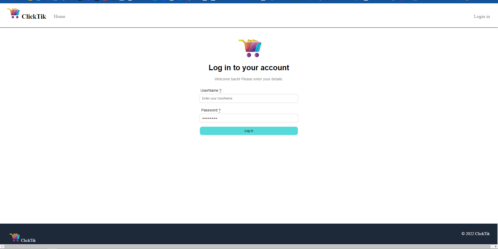
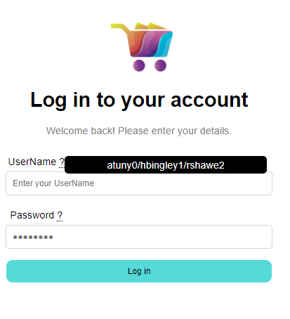
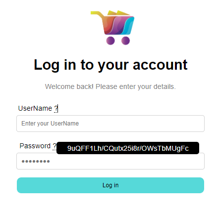
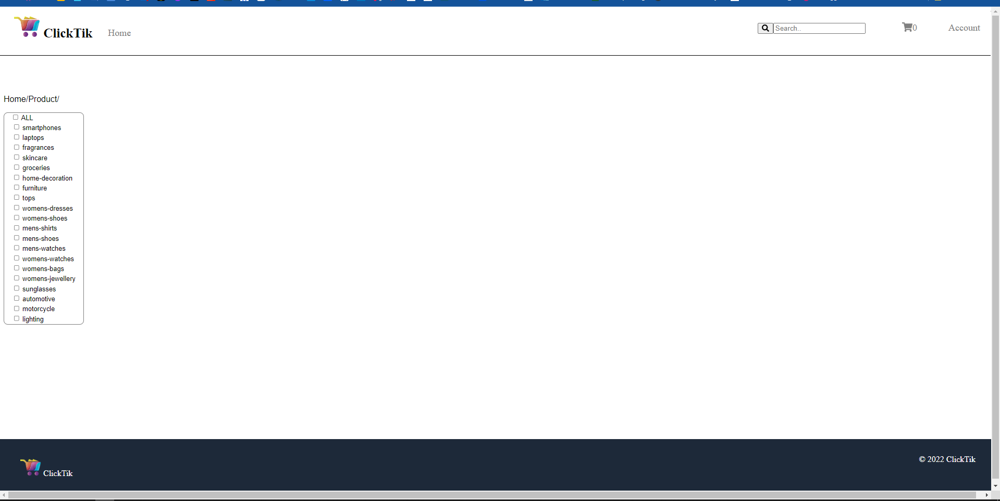
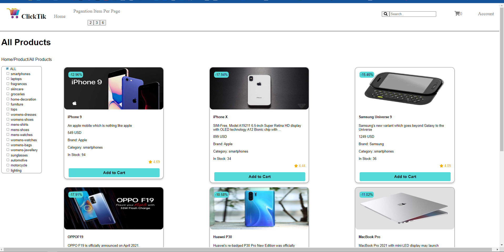
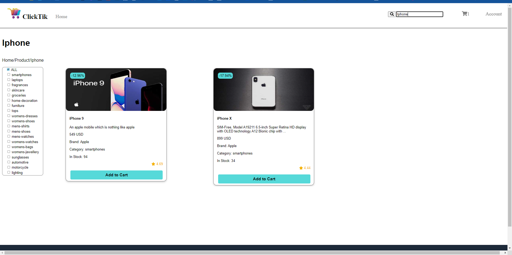
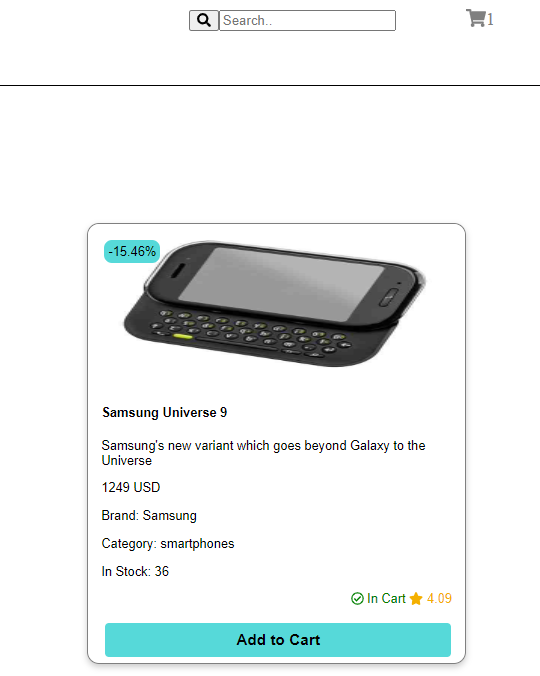
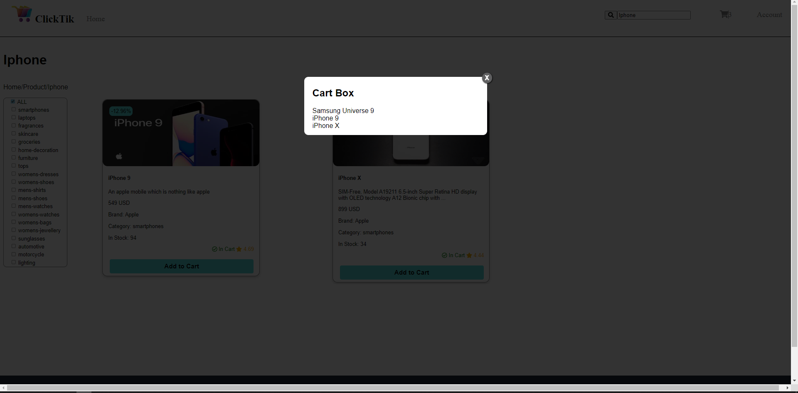

# Qurba

This project was generated with [Angular CLI](https://github.com/angular/angular-cli) version 15.0.1.
## Development server

Run `ng serve` for a dev server. Navigate to `http://localhost:4200/`. The application will automatically reload if you change any of the source files.
## the main page is the login page 

## Username & Pass
you can use the ones at the tooltip or just get any form the api.

  

## Home Page
you can only get here by token after login in this page is the product view and add to cart 

## product all 
pagination will only show here becoues every catagory have less then 5 item but the all have 30 but the pagination is dyanimac it will work when it get the length of fetch array and you can change the item perpage from the control button at the nav when all selected

## search for product 

## cart adding
there is green text with the checkmarke will show only if you addit this item to cart 

## cart modal 
when you click on the cart icon modal dialog will show the name of each item added to cart 

## problem not fiexed
the checkbox will get each category name but when trying to fetch all to show all the selected any join i tryed get an error but each category show it is data 
the only one worked is adding array as nested but that will make to complex to show the path to html using Ngfor.
